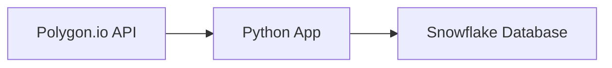

# 📈 Stock Trading Python App

This project fetches **stock ticker data** from the [Polygon.io API](https://polygon.io/) and loads it into a **Snowflake database** for storage and analysis.  

It supports **pagination** to handle large datasets and uses environment variables to securely manage API keys and database credentials.

## 📊 Data Flow



---

## 🚀 Features
- Fetches active stock tickers from Polygon.io’s REST API  
- Handles **pagination** for large datasets  
- Appends a timestamp (`ds`) to each record  
- Loads the data directly into **Snowflake** (with automatic table creation if missing)  
- Environment variables are managed securely with **dotenv**  

---

## 📦 Requirements
Install dependencies from `requirements.txt`:

```bash
pip install -r requirements.txt
